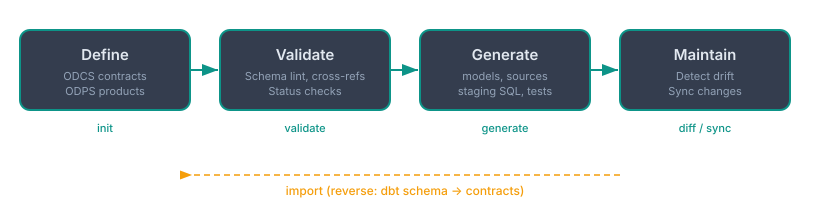

# dbt-contracts

**Contract-first dbt development using open standards.**

dbt-contracts generates and manages dbt projects from data contracts. Define your data shape, quality rules, and lineage in ODCS/ODPS YAML files, and let dbt-contracts produce the models, sources, staging SQL, and tests.

## The workflow

Or start from the other direction --- import existing dbt `schema.yml` files as contract stubs using `dbt-contracts import`.

## Key concepts

**Data contracts (ODCS)** define the promise about your data: what columns exist, their types, quality rules, who owns it, and what SLAs apply. Each contract maps to one or more dbt models or sources.

**Data products (ODPS)** define how data flows between systems. Input ports reference source contracts, output ports reference model contracts. This lineage determines whether generated SQL uses `{{ source() }}` or `{{ ref() }}`.

**Configuration** (`config.yaml`) controls generation behavior: output directories, whether to include tests, validation settings, and the default server type.

## Quick links

- [Getting Started](getting-started.md) --- install, first contract, generate dbt models
- [Writing Contracts](contracts.md) --- ODCS schema, quality, servers, team
- [Data Products](products.md) --- ODPS ports, lineage, cross-references
- [CLI Reference](cli.md) --- all commands, options, and flags
- [Architecture](architecture.md) --- how it works under the hood
